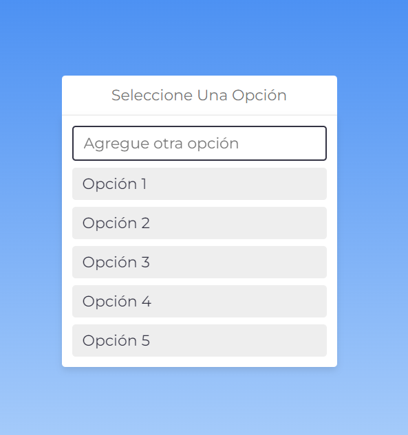
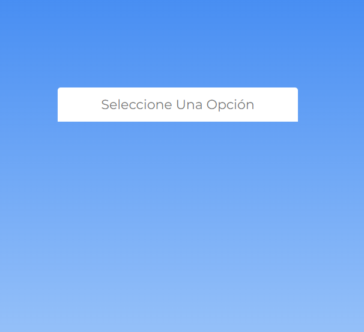
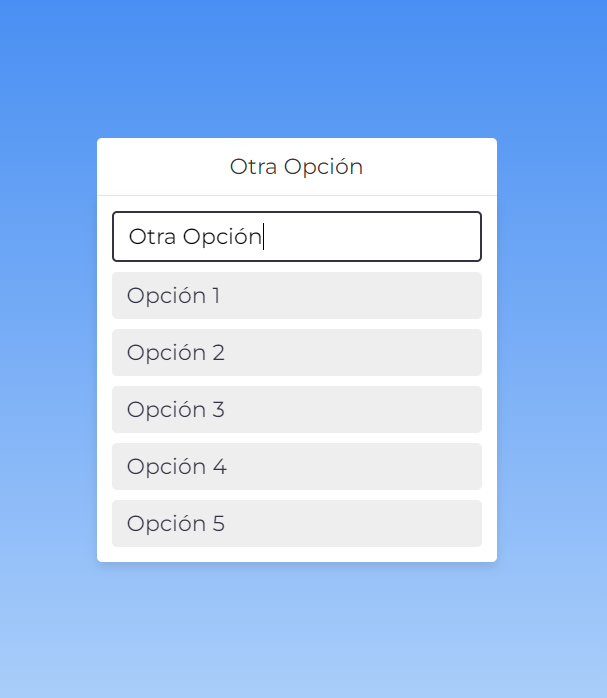

# Lista Desplegable con HTML/CSS/JAVASCRIPT.

## Descripción 📑

Lista desplegable personalizada con HTML/CSS/JS

<!-- 
## Paquetes de NuGet utilizados.
- Microsoft.EntityFrameworkCore.SqlServer
- Microsoft.EntityFrameworkCore.Tools
-->

## ¿Qué he aprendido en este proyecto? 🙇🏻 
- Manejo de "clases" con JS
- Desplegar lista con "hover"

## Tecnologías 🛠
<!-- Iconos sacados de: https://github.com/hendrasob/badges/blob/master/README.md y https://github.com/alexandresanlim/Badges4-README.md-Profile -->

<!--

-->
## Vista previa del proyecto
Si quieres hechas un vistazo al proyecto, te recomiendo:
### Lista sin desplegar.

### Lista desplegable - HOVER.

### Agregando otra opción.

## Autor ✒️
**MARTÍN ROJAS**

* [csamuelr.lp@gmail.com](csamuelr.lp@gmail.com)
* [LinkedIn](https://www.linkedin.com/in/martín-rojas-34b194245/)
* [Porfolio web](https://github.com/retak1ng/martindev.github.io)

<!--
## Instalación 
Este proyecto no necesita de instalación. Simplemente abre la carpeta o haz doble click en el .html

  
## Licencia 📄
MIT Public License v3.0
No puede usarse comencialmente.
-->
